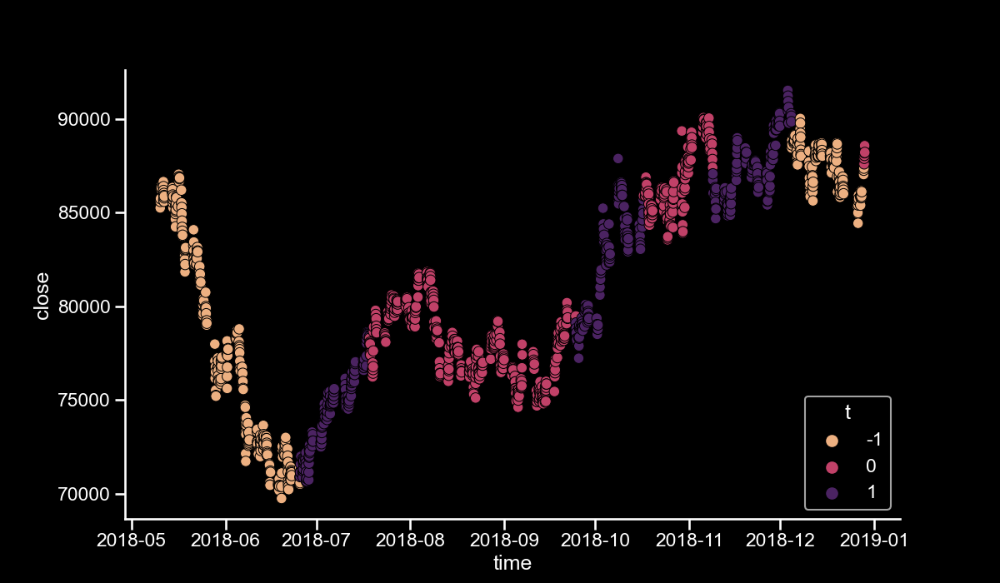

# Trend Scanning Label

We implement the Trend Scanning label as defined in [this article](https://papers.ssrn.com/sol3/papers.cfm?abstract_id=3257419)
by Marcos Lopez de Prado.

The trend scanning label is a label $t \in \{-1, 0, 1\}$
for us to use in machine learning training of time series.

